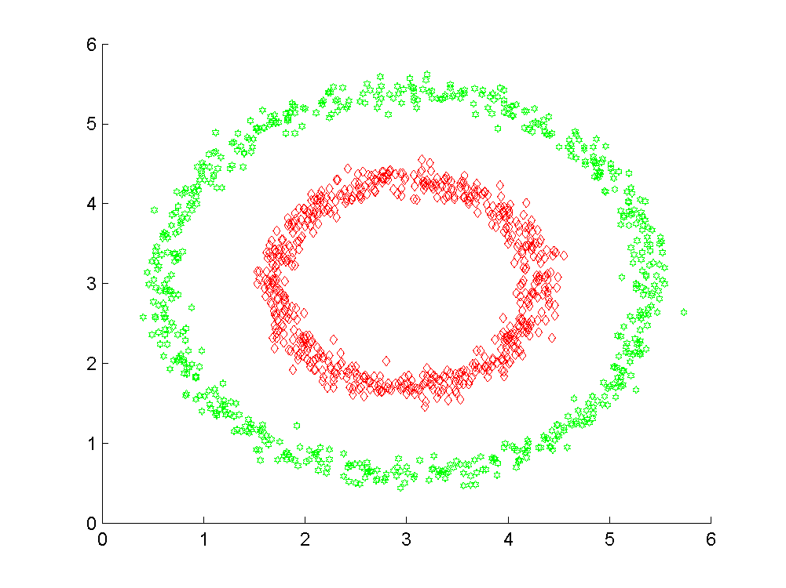

# Spectral cluster

# 谱聚类
Spectral clustering(谱聚类) 是一种基于图论的聚类方法，它能够识别任意形状的样本空间并收敛
于全局最优解。其基本的思想是将样本数据进行相似性计算得到相似度矩阵，然后将相似矩阵转换到
Laplacian 矩阵 (拉普拉斯矩阵)，做 Laplacian 矩阵的特征值分解，将得到的前$k$个特征向量按列排序后
按行做 $k$−means聚类，得到最终的聚类结果。

